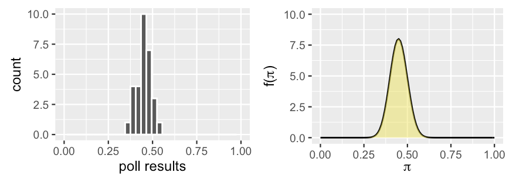

## Introduction: Beta-Binomial Model

- Last week, we learned how to think like a Bayesian.
    - Today, we will formalize the models we muddled through last time.

- This is called the Beta-Binomial model.
    - The Beta distribution is the *prior*.
    - The Binomial distribution is the *data* distribution (or the *likelihood*).
    - The *posterior* also follows a Beta distribution.
    
- **Conjugate family**: When the prior and posterior are the same named distribution, but different parameters.

## R Packages Needed

- To follow today's lecture, please load the following packages:


```{r}
library(tidyverse)
library(janitor)
library(bayesrules)
library(ggpubr)
```

```{r}
#| echo: false
library(latex2exp)
```

## Example Set Up

- Consider the following scenario. 
    - "Michelle" has decided to run for president and you're her campaign manager for the state of Florida. 
    - As such, you've conducted 30 different polls throughout the election season. 
    - Though Michelle's support has hovered around 45%, she polled at around 35% in the dreariest days and around 55% in the best days on the campaign trail.

- Past polls provide prior information about $\pi$, the proportion of Floridians that currently support Michelle. 

## Example Set Up

{fig-align="center" width="500" fig-alt="Histogram of poll results on left, density of poll results on right."}

- A reasonable prior is represented by the curve on the right. 

    - Notice that this curve preserves the overall information and variability in the past polls, i.e., Michelle's support, $\pi$ can be anywhere between 0 and 1, but is most likely around 0.45.
    
## Beta Prior

{fig-align="center" width="500" fig-alt="Histogram of poll results on left, density of poll results on right."}

- In building the Bayesian election model of Michelle's election support among Floridians, $\pi$, we begin with the prior. 

    - Our continuous prior probability model of $\pi$ is specified by the probability density function (pdf). 
    
- What values can $\pi$ take and which are more plausible than others?

## Beta Prior

- Let $\pi$ be a random variable, where $\pi \in [0, 1]$. 

- The variability in $\pi$ may be captured by a Beta model with hyperparameters $\alpha > 0$ and $\beta > 0$,

    - **hyperparameter:** a parameter used in a *prior* model.
    
$$\pi \sim \text{Beta}(\alpha, \beta)$$

## Beta Prior: Shapes

- Let's explore the shape of the Beta:


```{r}
#| fig-width: 12
#| fig-height: 6.5
#| fig-align: 'center'
#| fig-alt: "Density plot showing Beta(1,5)."
plot_beta(1, 5) + theme_minimal() + ggtitle("Beta(1, 5)")
```


## Beta Prior: Shapes

- Let's explore the shape of the Beta:

```{r}
#| fig-width: 12
#| fig-height: 6.5
#| fig-align: 'center'
#| fig-alt: "Density plot showing Beta(1,2)."
plot_beta(1, 2) + theme_minimal() + ggtitle("Beta(1, 2)")
```

## Beta Prior: Shapes

- Let's explore the shape of the Beta:

```{r}
#| fig-width: 12
#| fig-height: 6.5
#| fig-align: 'center'
#| fig-alt: "Density plot showing Beta(3, 7)."
plot_beta(3, 7) + theme_minimal() + ggtitle("Beta(3, 7)")
```

## Beta Prior: Shapes

- Let's explore the shape of the Beta:

```{r}
#| fig-width: 12
#| fig-height: 6.5
#| fig-align: 'center'
#| fig-alt: "Density plot showing Beta(1, 1)."
plot_beta(1, 1) + theme_minimal() + ggtitle("Beta(1, 1)")
```

## Beta Prior: Shapes

- Your turn!

- How would you describe the typical behavior of a:
    - Beta($\alpha, \beta$) variable, $\pi$, when $\alpha=\beta$?
    - Beta($\alpha, \beta$) variable, $\pi$, when $\alpha>\beta$?
    - Beta($\alpha, \beta$) variable, $\pi$, when $\alpha<\beta$?
    
- For which model is there greater variability in the plausible values of $\pi$, Beta(20, 20) or Beta(5, 5)?

## Beta Prior: Shapes

- How would you describe the typical behavior of a Beta($\alpha, \beta$) variable, $\pi$, when $\alpha=\beta$?
    
```{r}
#| echo: false
#| fig-width: 12
#| fig-height: 6.5
#| fig-align: 'center'
#| fig-alt: "Four density plots showing Beta distributions when alpha equals beta, for parameter values 1 through 4."

plot_scale <- list(xlim(0, 1), ylim(0, 2.5))

ggarrange(plot_beta(1, 1) + theme_minimal() + ggtitle("Beta(1, 1)") + plot_scale, 
          plot_beta(2, 2) + theme_minimal() + ggtitle("Beta(2, 2)") + plot_scale, 
          plot_beta(3, 3) + theme_minimal() + ggtitle("Beta(3, 3)") + plot_scale, 
          plot_beta(4, 4) + theme_minimal() + ggtitle("Beta(4, 4)") + plot_scale, 
          ncol=2, nrow=2)
```


## Beta Prior: Shapes

- How would you describe the typical behavior of a Beta($\alpha, \beta$) variable, $\pi$, when $\alpha>\beta$?

```{r}
#| echo: false
#| fig-width: 12
#| fig-height: 6.5
#| fig-align: 'center'
#| fig-alt: "Four density plots of Beta distributions where alpha is greater than beta"

plot_scale <- list(xlim(0, 1), ylim(0, 3.5))

ggarrange(plot_beta(2, 1) + theme_minimal() + ggtitle("Beta(2, 1)") + plot_scale, 
          plot_beta(4, 1) + theme_minimal() + ggtitle("Beta(4, 1)") + plot_scale,
          plot_beta(4, 2) + theme_minimal() + ggtitle("Beta(4, 2)") + plot_scale,
          plot_beta(10, 5) + theme_minimal() + ggtitle("Beta(10, 5)") + plot_scale,
          ncol=2, nrow=2)
```


## Beta Prior: Shapes

- How would you describe the typical behavior of a Beta($\alpha, \beta$) variable, $\pi$, when $\alpha<\beta$?
    
```{r}
#| echo: false
#| fig-width: 12
#| fig-height: 6.5
#| fig-align: 'center'
#| fig-alt: "Four density plots of Beta distributions where alpha is less than beta"

plot_scale <- list(xlim(0, 1), ylim(0, 3.5))

ggarrange(plot_beta(1, 2) + theme_minimal() + ggtitle("Beta(1, 2)") + plot_scale, 
          plot_beta(1, 4) + theme_minimal() + ggtitle("Beta(1, 4)") + plot_scale,
          plot_beta(2, 4) + theme_minimal() + ggtitle("Beta(2, 4)") + plot_scale,
          plot_beta(5, 10) + theme_minimal() + ggtitle("Beta(5, 10)") + plot_scale,
          ncol=2, nrow=2)
```

## Beta Prior: Shapes

- For which model is there greater variability in the plausible values of $\pi$, Beta(20, 20) or Beta(5, 5)?

```{r}
#| echo: false
#| fig-width: 12
#| fig-height: 6.5
#| fig-align: 'center'
#| fig-alt: "Two density plots of symmetric Beta distributions where alpha equals beta."

plot_scale <- list(xlim(0, 1), ylim(0, 5.5))

ggarrange(plot_beta(20, 20) + theme_minimal() + ggtitle("Beta(20, 20)") + plot_scale,
          plot_beta(5, 5) + theme_minimal() + ggtitle("Beta(5, 5)") + plot_scale,
          ncol=2)
```


## Tuning the Beta Prior

- We can *tune* the shape hyperparameters ($\alpha$ and $\beta$) to reflect our prior information about Michelle's election support, $\pi$.

- In our example, we saw that she polled between 25 and 55 percentage points, with an average of 45 percentage points.
    - We want our Beta($\alpha, \beta$) to have similar patterns, so we should pick $\alpha$ and $\beta$ such that $\pi$ is around 0.45.
    
$$
E[\pi] = \frac{\alpha}{\alpha+\beta} \approx 0.45
$$

- Using algebra, we can tune, and find

$$\alpha \approx \frac{9}{11} \beta$$

## Tuning the Beta Prior

- Your turn!

    - Graph the following and determine which is best for the example.
        
```{r}
#| eval: false

plot_beta(9, 11) + theme_minimal() + list(xlim(0, 1), ylim(0, 10))
plot_beta(27, 33) + theme_minimal() + list(xlim(0, 1), ylim(0, 10))
plot_beta(45, 55) + theme_minimal() + list(xlim(0, 1), ylim(0, 10))
```        
        
- Recall, this is what we are going for:        

{fig-align="center" fig-alt="Histogram of poll results on left, density of poll results on right."}

## Tuning the Beta Prior

```{r}
#| echo: false
#| fig-width: 12
#| fig-height: 6.5
#| fig-align: 'center'
#| fig-alt: "Plot of Beta(9, 11)."
plot_beta(9, 11) + theme_minimal() + ggtitle("Beta(9, 11)") + list(xlim(0, 1), ylim(0, 10))
```

{fig-align="center" fig-alt="Histogram of poll results on left, density of poll results on right."} 

## Tuning the Beta Prior

```{r}
#| echo: false
#| fig-width: 12
#| fig-height: 6.5
#| fig-align: 'center'
#| fig-alt: "Plot of Beta(27, 33)."
plot_beta(27, 33) + theme_minimal() + ggtitle("Beta(27, 33)") + list(xlim(0, 1), ylim(0, 10))
```

{fig-align="center" fig-alt="Histogram of poll results on left, density of poll results on right."}

## Tuning the Beta Prior

```{r}
#| echo: false
#| fig-width: 12
#| fig-height: 6.5
#| fig-align: 'center'
#| fig-alt: "Plot of Beta(45, 55)."
plot_beta(45, 55) + theme_minimal() + ggtitle("Beta(45, 55)") + list(xlim(0, 1), ylim(0, 10))
```

{fig-align="center" fig-alt="Histogram of poll results on left, density of poll results on right."} 

## Tuning the Beta Prior

- Now that we have a prior, we "know" some things.

$$\pi \sim \text{Beta}(45, 55)$$

- From the properties of the beta distribution,

$$
\begin{equation*}
\begin{aligned}
E[\pi] &= \frac{\alpha}{\alpha + \beta} & \text{ and } & \text{ } & \text{ }  \\
&=\frac{45}{45+55} \\
&= 0.45
\end{aligned} 
\begin{aligned}
\text{var}[\pi] &= \frac{\alpha\beta}{(\alpha+\beta)^2(\alpha+\beta+1)} \\
&= \frac{(45)(55)}{(45+55)^2(45+55+1)} \\
&= 0.0025
\end{aligned}
\end{equation*}
$$


## Binomial Data Model

- A new poll of $n = 50$ Floridians recorded $Y$, the number that support Michelle. 
    - The results depend upon $\pi$ (as $\pi$ increases, $Y$ tends to increase).
    
- To model the dependence of $Y$ on $\pi$, we assume
    - voters answer the poll independently of one another;
    - the probability that any polled voter supports your candidate Michelle is $\pi$
    
- This is a binomial event, $Y|\pi \sim \text{Bin}(50, \pi)$,  with conditional pmf, $f(y|\pi)$ defined for $y \in \{0, 1, ..., 50\}$

$$f(y|\pi) = P[Y = y|\pi] = {50 \choose y} \pi^y (1-\pi)^{50-y}$$

## Binomial Data Model

- The conditional pmf, $f(y|\pi)$, gives us answers to a hypothetical question:

    - If Michelle's support were given some value of $\pi$, then how many of the 50 polled voters ($Y=y$) might we expect to support her?

- Let's look at this graphically:

```{r}
#| eval: false
sample_size <- [value]
pi_value <- [value]
tibble(n_success = 1:sample_size,
       prob = dbinom(n_success, 
                     size=sample_size, 
                     prob=pi_value)) %>%
  ggplot(aes(x=n_success,y=prob)) +
  geom_col(width=0.2) +
  labs(x= "Number of Successes",
       y= "Probability") +
  theme_minimal()
```

## Binomial Data Model

```{r}
#| echo: false
#| fig-width: 12
#| fig-height: 6.5
#| fig-align: 'center'
#| fig-alt: "Three bar plots showing Binomial probability distributions"

sample_size <- 50
common_scale <- list(xlim(0, sample_size), ylim(0, 0.2))

make_binom_plot <- function(pi_value) {
  tibble(n_success = 0:sample_size,
    prob = dbinom(n_success, size = sample_size, prob = pi_value)) %>%
    ggplot(aes(x = n_success, y = prob)) +
    geom_col(width = 0.5) +
    labs(x = "Number of Successes",
         y = "Probability",
         title = bquote(pi == .(pi_value))) +
    theme_minimal() +
    common_scale
}

g1 <- make_binom_plot(0.1)
g2 <- make_binom_plot(0.5)
g3 <- make_binom_plot(0.8)

ggarrange(g1, g2, g3, ncol = 3)
```

## Binomial Data Model

- It is observed that $Y=30$ of the $n=50$ polled voters support Michelle.

- We now want to find the likelihood function -- remember that we treat $Y=30$ as the observed data and $\pi$ as unknown,

$$
\begin{align*}
f(y|\pi) &= {50 \choose y} \pi^y (1-\pi)^{50-y} \\
L(\pi|y=30) &= {50 \choose 30} \pi^{30} (1-\pi)^{20}
\end{align*}
$$

- This is valid for $\pi \in [0, 1]$.

## Binomial Data Model

- What is the likelihood of 30/50 voters supporting Michelle?

```{r}
#| eval: false
dbinom(30, 50, pi)
```

- You try this for $\pi = \{0.25, 0.50, 0.75\}$.

```{r}
#| eval: false
dbinom(30, 50, 0.25)
dbinom(30, 50, 0.5)
dbinom(30, 50, 0.75)
```

## Binomial Data Model

- What is the likelihood of 30/50 voters supporting Michelle?

```{r}
dbinom(30, 50, 0.25)
dbinom(30, 50, 0.5)
dbinom(30, 50, 0.75)
```
    
## Binomial Data Model

- Looking at $\pi$ in a more continuous fashion,


```{r}
#| echo: false
#| fig-width: 12
#| fig-height: 6.5
#| fig-align: 'center'
#| fig-alt: "A line plot showing the likelihood function for observing 30 successes in 50 Binomial trials across all possible values of pi from 0 to 1."
graph <- tibble(pi = seq(0, 1, 0.001)) %>%
  mutate(likelihood = dbinom(30, 50, pi))
graph %>% ggplot(aes(x = pi, y = likelihood)) +
  geom_line() +
  labs(x = "Probability of Success, pi", y = "Likelihood") +
  theme_minimal()
```


- Where is the maximum?

## Binomial Data Model

- Where is the maximum?

```{r}
#| echo: false
#| fig-width: 12
#| fig-height: 6.5
#| fig-align: 'center'
#| fig-alt: "A line plot showing the likelihood function for observing 30 successes in 50 Binomial trials across all possible values of pi from 0 to 1 with the maximum at pi=0.60."
graph <- tibble(pi = seq(0, 1, 0.001)) %>%
  mutate(likelihood = dbinom(30, 50, pi))
  
graph2 <- graph %>% filter(likelihood == max(likelihood))

graph %>% ggplot(aes(x = pi, y = likelihood)) +
  geom_line() +
  geom_point(data = graph2, color = "red", size = 3) +
  geom_text(data = graph2, label =  TeX(r'($\pi=0.60$)'), hjust=-.5) +
  labs(x = "Probability of Success", y = "Likelihood") +
  theme_minimal()
```

## The Beta Posterior Model

- The `plot_beta_binomial()` function:

```{r}
#| eval: false
plot_beta_binomial(alpha = prior_alpha, 
                   beta = prior_beta, 
                   y = num_success, 
                   n = num_trials, 
                   posterior = TRUE or FALSE) 
```

- The `summarize_beta_binomial()` function: 

```{r}
#| eval: false
summarize_beta_binomial(alpha = prior_alpha, 
                        beta = prior_beta, 
                        y = num_success, 
                        n = num_trials)
```

## The Beta Posterior Model

- Looking at just the prior and the data distributions,

```{r}
#| echo: false
#| fig-width: 12
#| fig-height: 6.5
#| fig-align: 'center'
#| fig-alt: "A line plot showing two curves: the prior Beta(45, 55) distribution and the scaled likelihood function for observing 30 successes in 50 trials."
plot_beta_binomial(alpha = 45, beta = 55, y = 30, n = 50, posterior = FALSE) + 
  theme_minimal()
```

- The prior is a bit more pessimistic about Michelle's election support than the data obtained from the latest poll.

## The Beta Posterior Model

- Now including the posterior,

```{r}
#| echo: false
#| fig-width: 12
#| fig-height: 6.5
#| fig-align: 'center'
#| fig-alt: "A line plot showing two curves: the prior Beta(45, 55) distribution, the scaled likelihood function for observing 30 successes in 50 trials, and the resulting posterior distribution."
plot_beta_binomial(alpha = 45, beta = 55, y = 30, n = 50) + theme_minimal()
```

- We can see that the posterior model of $\pi$ is continuous and $\in [0, 1]$.

- The shape of the posterior appears to also have a Beta($\alpha$, $\beta$) model.

    - The shape parameters ($\alpha$ and $\beta$) have been *updated*.

## The Beta Posterior Model
    
- If we were to collect more information about Michelle's support, we would use the current posterior as the new prior, then update our posterior. 

    - How do we know what the updated parameters are?

```{r}
summarize_beta_binomial(alpha = 45, beta = 55, y = 30, n = 50)
```

## The Beta Posterior Model

- We used Michelle's election support to understand the Beta-Binomial model.

- Let's now generalize it for any appropriate situation.

$$
\begin{align*}
Y|\pi &\sim \text{Bin}(n, \pi) \\
\pi &\sim \text{Beta}(\alpha, \beta) \\
\pi | (Y=y) &\sim \text{Beta}(\alpha+y, \beta+n-y)
\end{align*}
$$

- We can see that the posterior distribution reveals the influence of the prior ($\alpha$ and $\beta$) and data ($y$ and $n$).

## The Beta Posterior Model

- Under this updated distribution,

$$
\pi | (Y=y) \sim \text{Beta}(\alpha+y, \beta+n-y)
$$

- we have updated moments:

$$
\begin{align*}
E[\pi | Y = y] &= \frac{\alpha + y}{\alpha + \beta + n} \\
\text{Var}[\pi|Y=y] &= \frac{(\alpha+y)(\beta+n-y)}{(\alpha+\beta+n)^2(\alpha+\beta+n+1)}
\end{align*}
$$

## The Beta Posterior Model

- Let's pause and think about this from a theoretical standpoint.

- The Beta distribution is a *conjugate prior* for the likelihood.

    - **Conjugate prior**: the posterior is from the same model family as the prior.
    
- Recall the Beta prior, $f(\pi)$, 

$$ f(\pi) = \frac{\Gamma(\alpha+\beta)}{\Gamma(\alpha)\Gamma(\beta)} \pi^{\alpha-1}(1-\pi)^{\beta-1}, $$

- and the likelihood function, $L(\pi|y)$,

$$ L(\pi|y) = {n \choose y} \pi^y (1-\pi)^{n-y} $$


## The Beta Posterior Model

- We can put the prior and likelihood together to create the posterior,

$$
\begin{align*}
f(\pi|y) &\propto f(\pi)L(\pi|y) \\
&= \frac{\Gamma(\alpha+\beta)}{\Gamma(\alpha)\Gamma(\beta)} \pi^{\alpha-1}(1-\pi)^{\beta-1} \times {n \choose y} \pi^y (1-\pi)^{n-y} \\
&\propto \pi^{(\alpha+y)-1} (1-\pi)^{(\beta+n-y)-1}
\end{align*}
$$

- This is the same structure as the normalized Beta($\alpha+y, \beta+n-y$),

$$f(\pi|y) = \frac{\Gamma(\alpha+\beta+n)}{\Gamma(\alpha+y) \Gamma(\beta+n-y)} \pi^{(\alpha+y)-1} (1-\pi)^{(\beta+n-y)-1}$$

## Beta-Binomial: Example

- In Mario Kart 8 Deluxe, item boxes give different items depending on race position. To reduce the "position bias," only item boxes opened while the racer was in mid-pack (positions 4–10) were recorded. 

- You want to estimate the probability that an item box yields a Red Shell. When playing the Special Cup, only 31 red shells were seen in 114 boxes opened by mid-pack racers.

- Find the posterior distribution under two priors:
    1. Flat/uninformative prior, Beta(1,1).
    2. Beta($\alpha$, $\beta$) of your choosing.

## Wrap Up: Beta-Binomial Model

- We have built the Beta-Binomial model for $\pi$, an unknown proportion.

$$
\begin{equation*}
\begin{aligned}
Y|\pi &\sim \text{Bin}(n,\pi) \\
\pi &\sim \text{Beta}(\alpha,\beta) &
\end{aligned} 
\Rightarrow 
\begin{aligned}
&& \pi | (Y=y) &\sim \text{Beta}(\alpha+y, \beta+n-y) \\
\end{aligned}
\end{equation*}
$$

- The prior model, $f(\pi)$, is given by Beta($\alpha,\beta$).

- The data model, $f(Y|\pi)$, is given by Bin($n,\pi$).

- The likelihood function, $L(\pi|y)$, is obtained by plugging $y$ into the Binomial pmf.

- The posterior model is a Beta distribution with updated parameters $\alpha+y$ and $\beta+n-y$.

## Wrap Up

- Today we covered Beta-Binomial *conjugate family*.
    - Beta-Binomial: binary outcomes
    
- Next week: 
    - Gamma-Poisson: count outcomes
    - Normal-Normal: continuous outcomes


